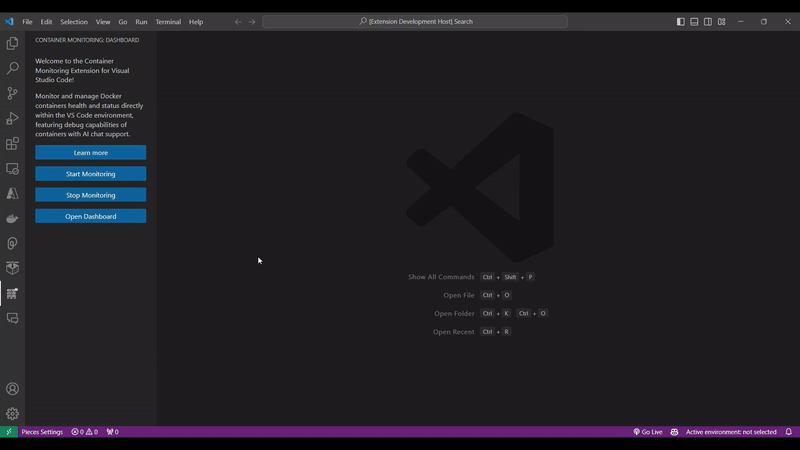
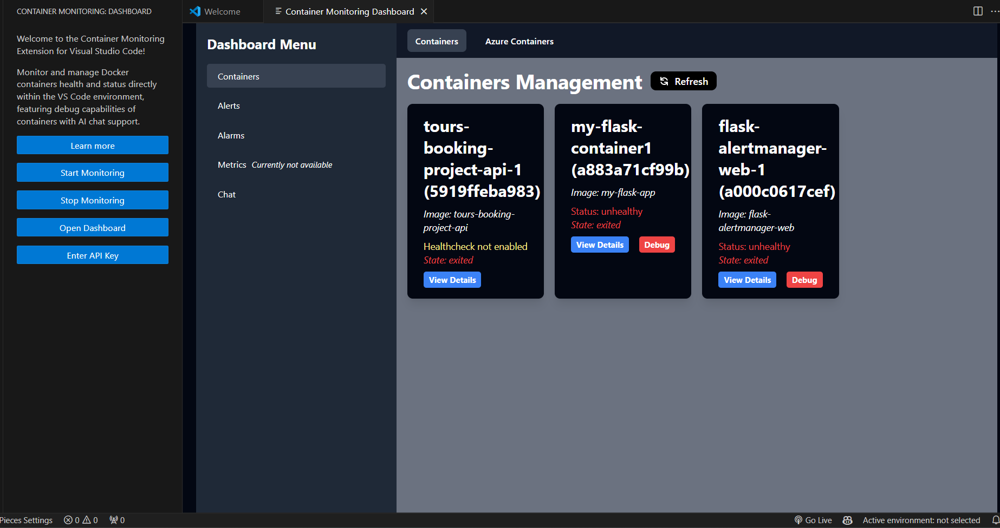
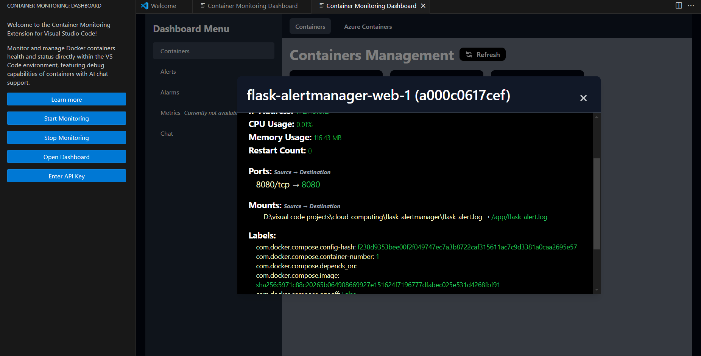
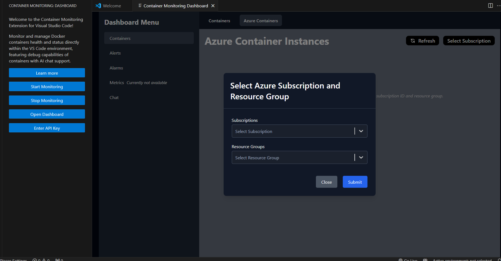
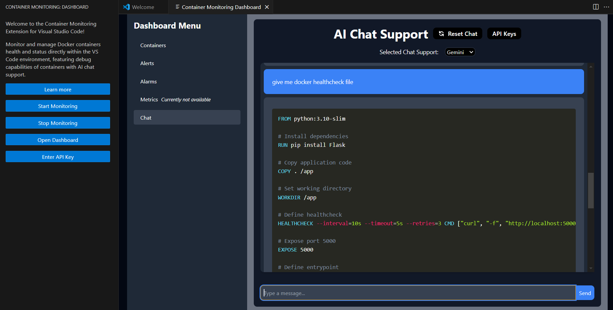

# Container Monitoring Extension for VSCode

This extension allows users to monitor and receive alerts on the health status of Docker containers, manage Docker containers and Azure Container Instances, and debug using AI chat, directly within the VS Code environment.

## Features

Watch the Container Monitoring Extension in action:

_Experience seamless container monitoring and management with our extension._

### Real-Time Alerts

- Receive real-time alerts for container health checks fails.
- Notifications for warnings and errors with container health.
- Automatically clear notifications when containers are healthy again.

_Stay updated with real-time notifications and alerts directly in VS Code._

### Container Lifecycle Management

- Manage the lifecycle of your containers and Azure Container Instances within a monitoring dashboard developed in ReactJS and Tailwind CSS.

_Effectively manage your containers with an intuitive, interactive dashboard._

_View and manage container details effortlessly within dashboard._

_Seamlessly manage your Azure Container Instances with interactive dashboard._

### AI Chat Support

- AI chat support for failed containers and programming queries, providing quick assistance and troubleshooting.

_Get instant support for your container issues through AI chat._

### Live Metrics and Stats

- Monitor live container metrics and stats to keep an eye on performance and resource usage.

_Track and analyze your container performance with live metrics._

## Requirements

- **Docker**: Ensure Docker is installed and running on your system.
- **DockerHealthCheck**: Ensure Docker HealthCheck is enabled.
- **AzureCLI**: Make sure the Azure CLI is installed and that you are logged in. You can check this from the VS Code terminal by running `az login` or `az account list`. To log in with a specific tenant ID, use `az login --tenant <tenant-id>`.

## Extension Settings

Enter API key, from view panel.

## Known Issues

No known issues at this time. Please report any bugs or feature requests through the GitHub repository.

## Release Notes

### 1.0.0

- Initial release of the Container Monitoring Extension.

### 1.1.0

- Added real-time alerts and notifications.
- Introduced automatic clearing of alerts feature.
- Introduced VS Code webview for the monitoring dashboard.

### 1.1.2

- Improved stability and performance.
- Fixed minor bugs in alert handling.
- Enhanced user interface for better user experience.

### 1.1.4 (Current)

- Added support for Azure Container Instances.
- Improved AI chat support with better troubleshooting suggestions.
- Updated the monitoring dashboard UI for a more streamlined experience.

## Getting Started

To begin using the Container Monitoring Extension:

1. Install the extension from the [VS Code Marketplace](https://marketplace.visualstudio.com/items?itemName=LiveContainerMonitoring.container-monitoring-extension).
2. Open VS Code and navigate to the Command Palette (`Ctrl+Shift+P` on Windows/Linux, `Cmd+Shift+P` on macOS).
3. Type "**Start Container Monitoring**" and select it to initialize the extension.
4. Access the **Container Monitoring Dashboard** from the Command Palette to view and manage container health and status.
5. Type "**Stop Container Monitoring**" and select it to stop Monitoring.

Ensure Docker is installed and running on your system for the extension to function properly.

**Currently, monitoring is only available for containers enabled with HEALTHCHECK.**

**Happy monitoring!**

## For More Information

For more details on how to use and contribute to this extension, visit my [GitHub repository](https://github.com/abinay-devulapally/container-monitoring-extension).

**Enjoy monitoring your containers with ease!**
