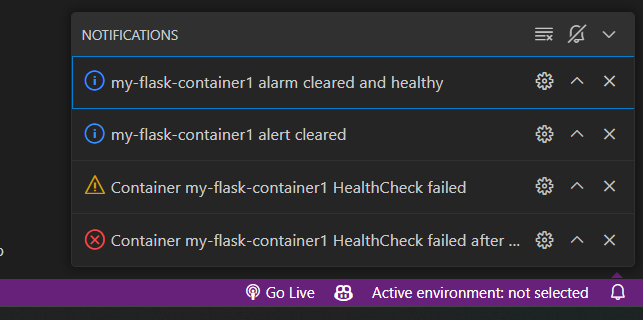
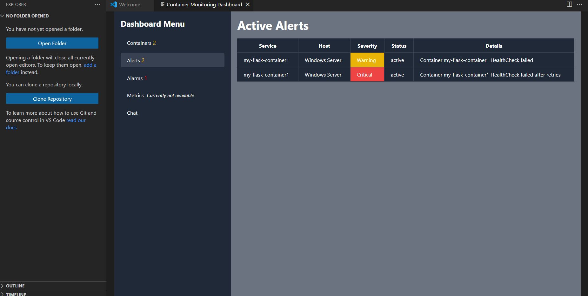
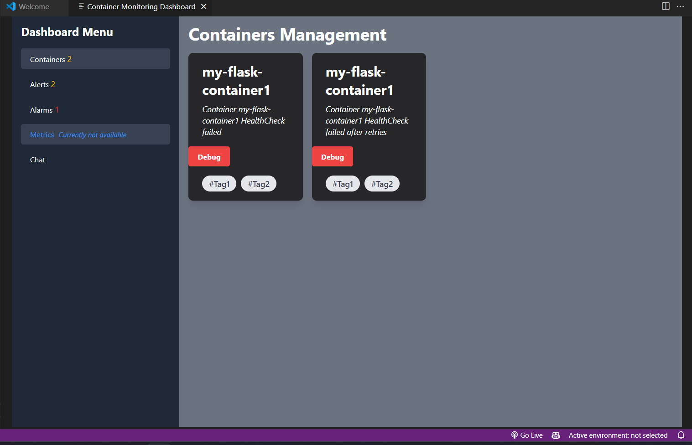
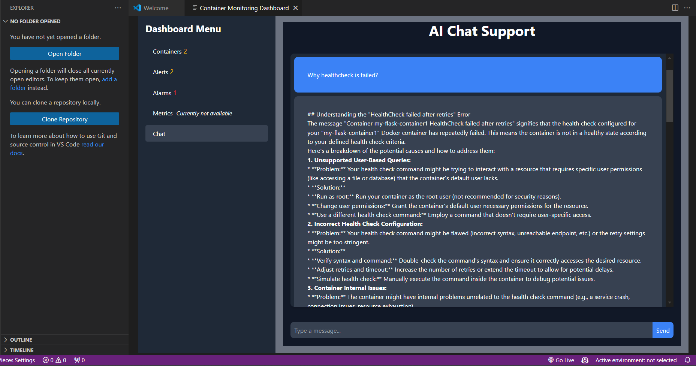
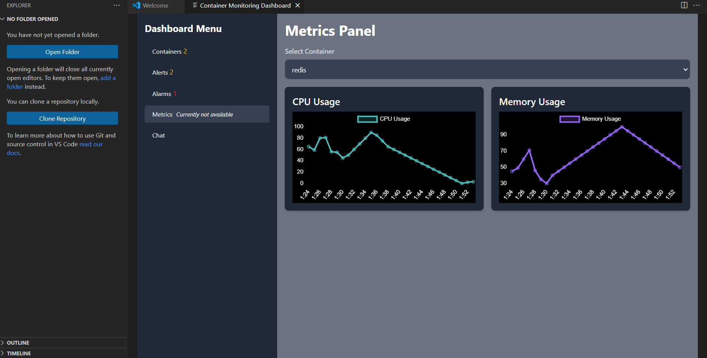

# Container Monitoring Extension README

Welcome to the Container Monitoring Extension for Visual Studio Code! This extension allows users to monitor the health and status of Docker containers directly within the VS Code environment.

## Features

- **Real-Time Alerts**: Receive real-time alerts for container health checks.
- **Notifications**: Get notifications for warnings and errors with container health.
- **Automatic Clear Alerts**: Automatically clear notifications when containers are healthy again.

- Container lifecycle management in a monitoring dashboard developed in ReactJS and Tailwind CSS.

- AI chat support of failed containers.

- Live containers metrics/stats.

## Requirements

- **Docker**: Ensure Docker is installed and running on your system.
- **DockerHealthCheck**: Ensure Docker HealthCheck is enabled.
- **Dockerode**: The extension depends on the Dockerode Node.js library. Install it via npm:

## Extension Settings

To be updated

## Known Issues

No known issues at this time. Please report any bugs or feature requests through our GitHub repository.

## Release Notes

### 1.0.0

- Initial release of the Container Monitoring Extension.

### 1.1.0

- Added real-time alerts and notifications.
- Introduced automatic clearing of alerts feature.
- Introduced vscode webview of monitoring dashboard.

## Getting Started

To begin using the Container Monitoring Extension:

1. Install the extension from the [VS Code Marketplace](https://marketplace.visualstudio.com/items?itemName=yourusername.container-monitoring-extension).
2. Open VS Code and navigate to the Command Palette (`Ctrl+Shift+P` on Windows/Linux, `Cmd+Shift+P` on macOS).
3. Type "**Start Container Monitoring**" and select it to initialize the extension.
4. Access the **Container Monitoring Dashboard** from the Command Palette to view and manage container health and status.

Ensure Docker is installed and running on your system for the extension to function properly.

**Currently, monitoring is only available for containers enabled with HEALTHCHECK.**

**Happy monitoring!**

## For More Information

For more details on how to use and contribute to this extension, visit my [GitHub repository](https://github.com/abinay-devulapally/container-monitoring-extension).

**Enjoy monitoring your containers with ease!**
